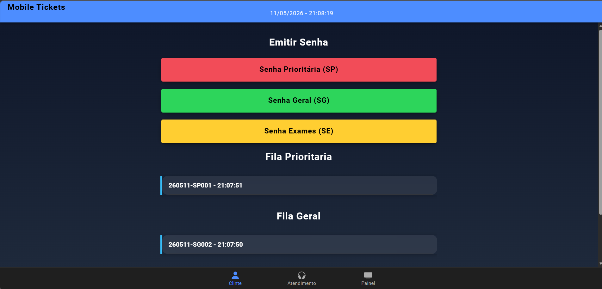
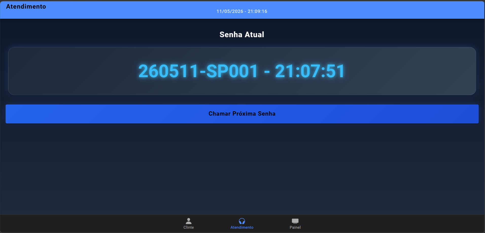
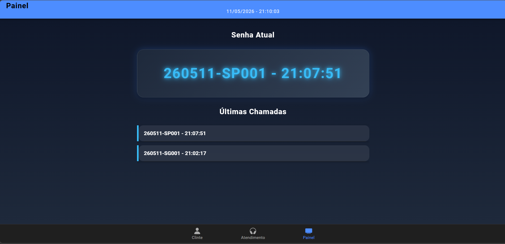
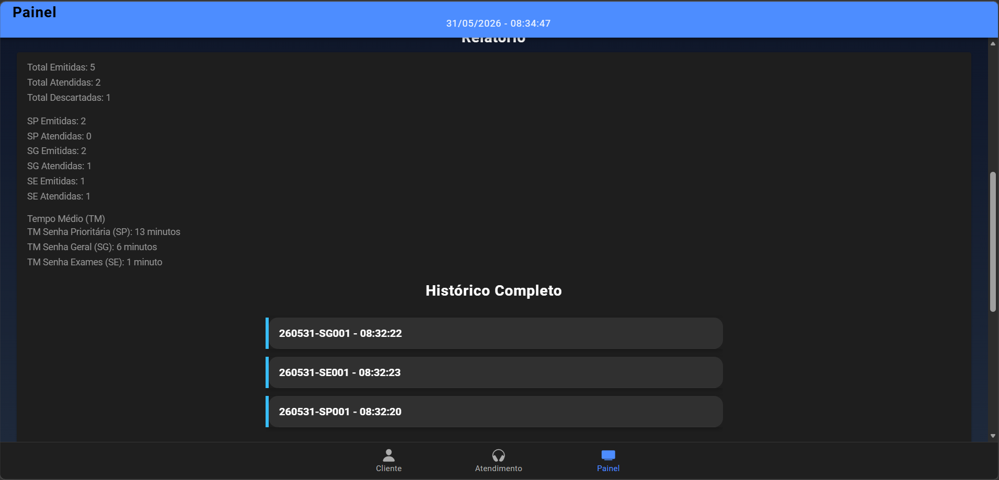
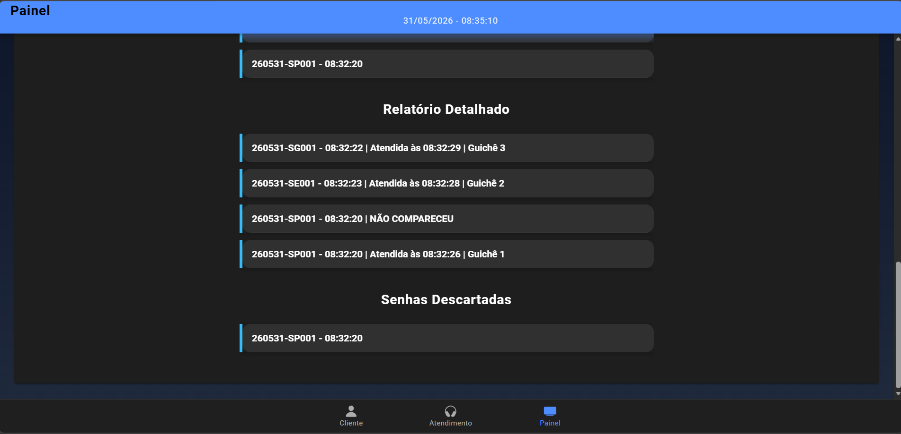

# MobileTicketsIonic

Sistema de controle de atendimento para laboratórios médicos desenvolvido com Ionic Framework e Angular.

## Funcionalidades

### Emissão de Senhas

* SP (Senha Prioritária)
* SG (Senha Geral)
* SE (Senha para Exames)

### Controle de Atendimento

* Priorização das senhas:

  * SP → SE → SG
* Controle de filas por tipo de senha.
* Chamada de senhas para guichês.
* Exibição da senha atual.
* Exibição das 5 últimas chamadas.

### Controle de Expediente

* Início do expediente às 07:00.
* Encerramento do expediente às 17:00.
* Descarte automático das senhas restantes após o encerramento.

### Relatórios

* Total de senhas emitidas.
* Total de senhas atendidas.
* Total de senhas descartadas.
* Quantitativo por tipo de senha.
* Histórico completo das chamadas.
* Relatório detalhado com:

  * Senha.
  * Data e hora do atendimento.
  * Guichê responsável.
* Lista de senhas descartadas.
* Relatório de Tempo Médio (TM).

### Regras Implementadas

* Reinício diário da sequência das senhas.
* Descarte de aproximadamente 5% das senhas por não comparecimento.
* Controle de guichês.
* Controle de prioridades.

## Tecnologias Utilizadas

* Ionic Framework
* Angular
* TypeScript
* Capacitor

## Execução do Projeto

Instalar dependências:

```bash
npm install
```

Executar o projeto:

```bash
ionic serve
```

## Imagens do Projeto

### Tela Cliente



### Tela Atendimento



### Tela Painel





## Autores

* Matheus Filipe
* Pedro Venâncio
* Humberto Gueiros

Curso de Análise e Desenvolvimento de Sistemas - UNINASSAU
